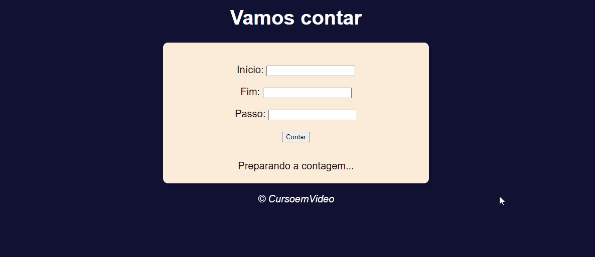
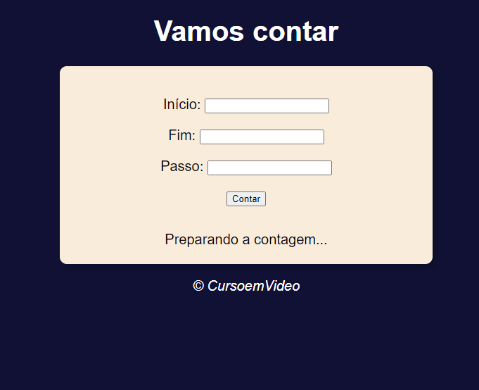
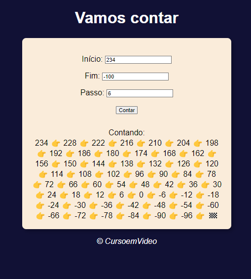

# Contador

O exercício se trata de um contador, no qual o usuário decide o número inicial, final e o passo que o número dará para chegar no que se propôs. Também há a possibilidade de fazer do final para o início.

## Menu

- [Screenshot](#screenshot)
- [Links](#links)
- [Feito com](#feito-com)
- [o que aprendi](#o-que-aprendi)
- [Autor](#autor)
- [Contato](#contato)

### Screenshot

### Links

- Site do projeto: [Projeto](https://bruno-nog.github.io/contador/)

### Feito com:

- HTML5
- CSS3
- JavaScript

### O que aprendi

O contador foi idealizado com o objetivo de praticar números e laços de repetições no JS. Utilizando os números dados pelo usuário, o programa passa os passos dos números respectivos até chegar no final ou como falado anteriormente, até o início.

## Autor

- Frontend Mentor - [@Bruno-nog](https://www.frontendmentor.io/profile/Bruno-nog)

## Contato

